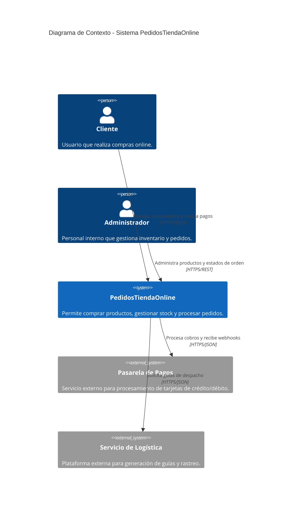
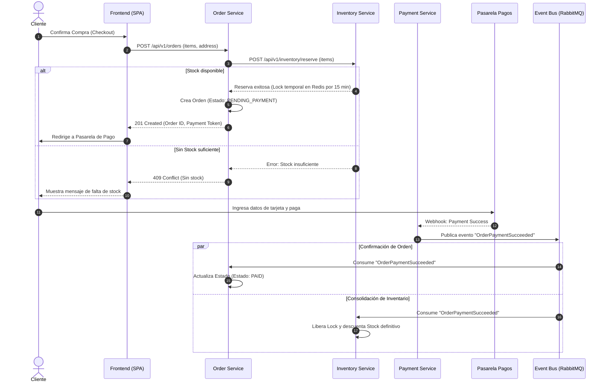

# PedidosTiendaOnline - Documentación de Arquitectura y Sistema

Este repositorio contiene la especificación, diseño de arquitectura y documentación técnica para la plataforma de gestión de pedidos e inventario **PedidosTiendaOnline**.

---

## 1. Objetivo, Actores y Alcance

### Objetivo
Diseñar e implementar una plataforma resiliente, escalable y mantenible para la gestión y procesamiento de pedidos en tiempo real en una tienda online, garantizando la consistencia de inventario, el procesamiento seguro de pagos y una experiencia de usuario fluida.

### Actores
* **Cliente / Comprador:** Usuario final que navega por el catálogo, realiza pedidos, procesa pagos y consulta el estado de sus envíos.
* **Administrador / Gestor de Inventario:** Personal interno responsable de la gestión de productos, actualización de inventarios, procesamiento de logística y consulta de reportes.
* **Sistema Integrado de Pagos (Tercero):** Pasarela de pagos externa (ej. Stripe/PayPal) encargada de la tokenización y cobro de transacciones.
* **Sistema de Envíos / Logística (Tercero):** Proveedor logístico para generación de guías y rastreo de entregas.

### Alcance
* **Dentro del Alcance:**
  * Catálogo de productos y gestión de stock en tiempo real.
  * Carrito de compras y flujo completo de checkout.
  * Procesamiento asíncrono e idempotente de pedidos y pagos.
  * Notificaciones de cambio de estado de pedidos.
  * Panel administrativo para gestión de ordenes e inventario.
* **Fuera del Alcance:**
  * Facturación electrónica con entes gubernamentales (se maneja por módulo contable externo).
  * Gestión de soporte y tickets de atención al cliente.

---

## 2. Requisitos Funcionales y de Calidad

### Requisitos Funcionales (RF)
1. **RF-01 (Gestión de Catálogo):** El sistema debe permitir listar, filtrar y buscar productos con stock disponible en tiempo real.
2. **RF-02 (Procesamiento de Pedidos):** El sistema debe permitir la creación de pedidos reteniendo temporalmente el stock durante el flujo de pago.
3. **RF-03 (Integración de Pagos):** El sistema debe recibir eventos/webhooks de confirmación o fallo de pago y actualizar el estado de la orden en consecuencia.
4. **RF-04 (Historial y Seguimiento):** Los clientes deben poder consultar el historial y el estado en tiempo real de sus pedidos.

### Requisitos de Calidad / No Funcionales (RNF)
1. **RNF-01 (Escalabilidad y Disponibilidad):** Disponibilidad del 99.9% ($3.5$ naves/año) con capacidad de auto-escalado horizontal en picos de demanda (Black Friday, Hot Sale).
2. **RNF-02 (Rendimiento):** Tiempo de respuesta p95 $< 200\text{ ms}$ para lecturas de catálogo y $< 500\text{ ms}$ para creación de pedidos.
3. **RNF-03 (Consistencia e Idempotencia):** Cero sobreventas de inventario mediante bloqueos pesimistas/distribuidos y procesamiento idempotente de eventos de pago.
4. **RNF-04 (Seguridad):** Cifrado de datos en tránsito ($\text{TLS 1.3}$) y en reposo ($\text{AES-256}$), autenticación basada en $\text{JWT}$ y cumplimiento de buenas prácticas OWASP.

---

## 3. Diagramas C4 (Contexto y Contenedores)

### Nivel 1: Diagrama de Contexto



### Nivel 2: Diagrama de Contenedores

```mermaid
C4Container
    title Diagrama de Contenedores - Sistema PedidosTiendaOnline

    Person(cliente, "Cliente", "Comprador de la tienda")
    
    ContainerUI(spa, "Single Page Application", "React, Tailwind CSS", "Interfaz Web para clientes y administración")
    
    Container(apiGateway, "API Gateway / Ingress", "NGINX / Kong", "Enrutamiento, Rate Limiting y SSL Termination")
    
    Container(orderService, "Order Service", "Node.js / Express", "Gestión del ciclo de vida de pedidos")
    Container(catalogService, "Catalog & Inventory Service", "Go / Gin", "Gestión de productos y control de stock concurrente")
    Container(paymentService, "Payment Service", "Node.js / Express", "Integración con pasarela de pagos y gestión de webhooks")
    
    ContainerDb(dbOrders, "Order DB", "PostgreSQL", "Almacena transacciones y pedidos")
    ContainerDb(dbCatalog, "Catalog DB", "PostgreSQL", "Almacena productos e inventarios")
    ContainerDb(cache, "Cache & Distributed Lock", "Redis", "Caché de catálogo y locks temporales de stock")
    
    ContainerDb(eventBus, "Event Bus", "RabbitMQ / Kafka", "Broker de mensajería para eventos de dominio")

    System_Ext(pasarelaPago, "Pasarela de Pagos", "Stripe / PayPal")

    Rel(cliente, spa, "Usa", "HTTPS")
    Rel(spa, apiGateway, "Peticiones API", "JSON/HTTPS")
    
    Rel(apiGateway, orderService, "Ruta /orders", "gRPC / HTTP")
    Rel(apiGateway, catalogService, "Ruta /products", "gRPC / HTTP")
    Rel(apiGateway, paymentService, "Ruta /payments", "gRPC / HTTP")

    Rel(orderService, dbOrders, "Lee/Escribe", "SQL")
    Rel(catalogService, dbCatalog, "Lee/Escribe", "SQL")
    Rel(catalogService, cache, "Locks / Cache", "Redis Protocol")
    
    Rel(orderService, eventBus, "Publica 'OrderCreated'", "AMQP")
    Rel(paymentService, eventBus, "Publica 'PaymentConfirmed'", "AMQP")
    Rel(eventBus, catalogService, "Consume eventos", "AMQP")
    Rel(eventBus, orderService, "Consume eventos", "AMQP")
    
    Rel(paymentService, pasarelaPago, "Procesa cobro", "HTTPS")
```

---

## 4. Flujo de una Operación Crítica: Creación y Confirmación de Pedido

El proceso crítico abarca la reserva temporal de stock, el cobro asíncrono y la confirmación final de la orden.



---

## 5. Stack Propuesto y Justificación

| Componente | Tecnología | Justificación Técnica |
| :--- | :--- | :--- |
| **Frontend** | React + TypeScript + Tailwind CSS | Permite construir una interfaz rápida, tipada y reactiva con reusabilidad de componentes. |
| **Backend Services** | Node.js (TypeScript) / Go | **Go** para el *Catalog Service* debido a su alto rendimiento e hiper-concurrencia al manejar stock; **Node.js** por la velocidad de desarrollo para lógica orientada a dominio (*Orders*). |
| **Base de Datos Relacional**| PostgreSQL | Proporciona ACID estricto para transacciones financieras y de inventario donde no se permite inconsistencia. |
| **Caché y Locks** | Redis | Altísima velocidad para lectura de catálogo y capacidad nativa de manejo de cerrojos distribuidos (*Redlock*) para evitar condiciones de carrera en inventario. |
| **Broker de Mensajes** | RabbitMQ / Kafka | Garantiza desacoplamiento, patrones Pub/Sub, resiliencia y entrega de mensajes *at-least-once* para procesamiento asíncrono de eventos. |
| **Infraestructura / DevOps**| Docker + Kubernetes | Empaquetamiento estandarizado, aislamiento y escalado automático horizontal (HPA) basado en carga de trabajo. |

---

## 6. Architectural Decision Records (ADR)

### ADR 01: Adopción de Arquitectura Orientada a Eventos (EDA) para Procesamiento de Pedidos

* **Estatus:** Aprobado
* **Contexto:** En picos de alta demanda, la integración síncrona mediante REST entre *Orders*, *Payments* e *Inventory* genera alta latencia, acoplamiento directo y fallos en cascada si un servicio externo o interno falla.
* **Decisión:** Implementar comunicación asíncrona basada en eventos de dominio utilizando RabbitMQ como Message Broker para la confirmación de pago e inventario.
* **Consecuencias:**
  * **Positivas:** Desacoplamiento total de servicios, alta disponibilidad ante caída temporal de microservicios y amortiguación de picos de tráfico (*traffic leveling*).
  * **Negativas:** Incremento en la complejidad de infraestructura, consistencia eventual en el flujo post-pago y necesidad de implementar mecanismos de trazabilidad/observabilidad distribuidos.

---

### ADR 02: Uso de Redis para Bloqueo Distribuido (Redlock) en Reserva de Stock

* **Estatus:** Aprobado
* **Contexto:** Varios usuarios intentando comprar la última unidad de un producto en simultáneo generan condiciones de carrera (*race conditions*), pudiendo ocasionar sobreventas (*overselling*).
* **Decisión:** Utilizar Redis con patrones de bloqueo distribuido temporizado (*TTL*) para reservar stock durante la fase de checkout antes de persistir la transacción en la base de datos PostgreSQL.
* **Consecuencias:**
  * **Positivas:** Tiempos de respuesta ultra bajos ($< 5\text{ ms}$) para validar y bloquear unidades; protección garantizada contra sobreventas.
  * **Negativas:** Si Redis no está configurado con persistencia/alta disponibilidad adecuada, la pérdida de un nodo durante la reserva puede requerir expiración por timeout.

---

## 7. Riesgos y Plan de Mitigación

1. **Riesgo 1: Sobreventa de Productos por Accesos Concurrentes (Race Conditions)**
   * *Impacto:* Alto (Pérdida de reputación y penalizaciones operativas).
   * *Mitigación:* Implementación de cierres distribuidos en Redis durante el intento de reserva, complementado con transacciones con aislamiento `SERIALIZABLE` o `SELECT FOR UPDATE` en PostgreSQL a nivel de base de datos.

2. **Riesgo 2: Procesamiento Duplicado de Pagos por Reintentos de Webhooks**
   * *Impacto:* Alto (Cobros dobles al cliente, problemas legales y disconformidad).
   * *Mitigación:* Implementar un patrón de **Idempotencia** en el *Payment Service*. Cada webhook entrante debe registrar el `transaction_id` único en una tabla de transacciones procesadas antes de realizar cambios de estado.

3. **Riesgo 3: Caída o Indisponibilidad de la Pasarela de Pagos Externa**
   * *Impacto:* Crítico (Imposibilidad de completar compras).
   * *Mitigación:* Implementar el patrón **Circuit Breaker** (ej. mediante Resilience4j o Opossum). En caso de fallo prolongado del proveedor primario, el sistema puede conmutar a una pasarela secundaria (*fallback*) o degradar suavemente permitiendo guardar la orden en borrador.

---

## 8. Métricas Clave

### Métrica de Negocio: Tasa de Conversión de Checkout (Checkout Conversion Rate)
* **Definición:** Porcentaje de carritos/pedidos iniciados que terminan exitosamente en el estado `PAID`.
$$\text{Conversion Rate} = \left( \frac{\text{Pedidos Pagados Exitosamente}}{\text{Checkouts Iniciados}} \right) \times 100$$
* **Objetivo:** $> 85\%$ en condiciones normales de operación.

### Métrica Técnica: Tiempo de Procesamiento Final de Orden (End-to-End Order Latency - p99)
* **Definición:** El tiempo transcurrido desde que la pasarela emite el evento de pago exitoso hasta que la orden queda registrada en estado `PAID` y el stock consolidado.
* **Objetivo:** $< 1.5\text{ segundos}$ en el percentil 99 ($p99$).
